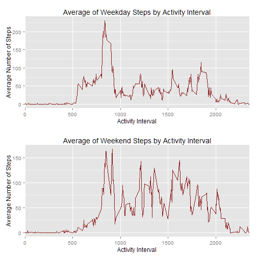

Reproducible Research : Week 2 Peer Assessment
=============================================

Load the necessary libraries

```r
library(Hmisc)
```

```
## Loading required package: grid
## Loading required package: lattice
## Loading required package: survival
## Loading required package: splines
## Loading required package: Formula
## 
## Attaching package: 'Hmisc'
## 
## The following objects are masked from 'package:base':
## 
##     format.pval, round.POSIXt, trunc.POSIXt, units
```

```r
library(plyr)
```

```
## 
## Attaching package: 'plyr'
## 
## The following objects are masked from 'package:Hmisc':
## 
##     is.discrete, summarize
```

```r
library(ggplot2)
```
Assignment: Loading and preprocessing the data
===============================================

Load the Activity data from activity.csv. This set will be used repeatedly.
Variables will not be updated but columns of variables may be added.

```r
setwd("J:\\_Coursera\\RRWeek2")
d.activity <- read.csv("activity.csv")
```

Assignment: What is mean total number of steps taken per day?
=============================================================

1 - Make a histogram of the total numbe of steps taken each day

Prepare the data by summing on Date

```r
d.datesum <- aggregate(d.activity$steps,list(d.activity$date),sum)
colnames(d.datesum) <- c("Date","Steps")
```
Create histogram plot of the Steps activity

```r
p.histstepsday <- ggplot(d.datesum, aes(x=Steps)) + 
  geom_histogram(aes(fill = ..count..)) +
  scale_fill_gradient("Count", low = "orange", high = "firebrick4") +
  scale_x_continuous(name="Activity Interval",breaks=c(seq(0,30000,5000))) +
  scale_y_continuous(name="Count of Steps",breaks=seq(0,12,2.5)) +
  ggtitle("Distribution of Steps by Activity Interval")
```

```r
print(p.histstepsday)
```

```
## stat_bin: binwidth defaulted to range/30. Use 'binwidth = x' to adjust this.
```

 

2 - Calculate and report the mean and median total number of steps taken per day
These is a simple application of the mean() and median() functions.
Note the removal of NAs.

Mean

```r
mean(d.datesum$Steps,na.rm=TRUE)
```

```
## [1] 10766
```

```r
d.median <- median(d.datesum$Steps,na.rm=TRUE)
```
Median

```r
median(d.datesum$Steps,na.rm=TRUE)
```

```
## [1] 10765
```
Assignment: What is the average daily activity pattern?
=======================================================

1 - 1.Make a time series plot (i.e. type = "l") of the 5-minute interval (x-axis) and the average number of steps taken, averaged across all days (y-axis)

To address the data requirements I chose to add a new column to the Activity data frame in which I 
set the NAs to 0 as a requirement for the subsequent aggregations. I believe this is the best choice for this particular analysis as the average will include the count of Intervals even though there is no reported data.


```r
d.activity$StepsNoNA <- d.activity$steps
d.activity$StepsNoNA[is.na(d.activity$StepsNoNA)] <- 0
```

Calculate the mean values of the Activity data on the updated Steps variable and add column names.

```r
d.intervalmean <- aggregate(d.activity$StepsNoNA,list(d.activity$interval),mean)
colnames(d.intervalmean) <- c("Interval","Average")
```

Create a time-series plot of Average Steps by Interval

```r
p.timeseriesintervalsteps <- ggplot(d.intervalmean, aes(x=Interval,y=Average)) + 
  geom_line(colour="firebrick4") +
  scale_x_continuous(name="Activity Interval",breaks=c(seq(0,3000,500))) +
  scale_y_continuous(name="Average Number of Steps",breaks=seq(0,200,50)) +
  ggtitle("Average of Steps by Activity Interval")
```
Print the plot

```r
print(p.timeseriesintervalsteps)
```

 

2 - 2.Which 5-minute interval, on average across all the days in the dataset, contains the maximum number of steps?

I executed this task by ordering the variable by the Interval Mean and writing it into a factor for display.

```r
d.intervalmeanmax <- tail(d.intervalmean[order(d.intervalmean[,2]),],1)
d.intervalmeanmax$Interval
```

```
## [1] 835
```

Assignment: Imputing missing values
===================================

1- Calculate and report the total number of missing values in the dataset.
This task was calculated by writing the NAs into a vector then reporting the length of the vector.

```r
length(which(is.na(d.activity$steps)))
```

```
## [1] 2304
```

2 - Devise a strategy for filling in all of the missing values in the dataset.
For this exercise I chose to populate the NAs using the mean() function. 
This was embedded in an Impute function then applied to the data frame. A more detailed
strategy might be to examine the variable values on the same interval surrounding the specific
day and using a mean of a smaller set of variables that are more closely related.

```r
impute.mean <- function(x) replace(x, is.na(x), mean(x, na.rm = TRUE))
```

3 - Create a new dataset that is equal to the original dataset but with the missing data filled in.


```r
d.activityimputed <- plyr::ddply(d.activity[1:3], .(interval), transform,
                                steps = impute.mean(steps),
                                date = date,
                                interval = interval)
```

4 - Make a histogram of the total number of steps taken each day. 

Prepare the data by summing the Steps by Date

```r
d.datesumimputed <- aggregate(d.activityimputed$steps,list(d.activityimputed$date),sum)
colnames(d.datesumimputed) <- c("Date","Steps")
```

Prepare the required plot

```r
d.datesumimputed <- aggregate(d.activityimputed$steps,list(d.activityimputed$date),sum)
colnames(d.datesumimputed) <- c("Date","Steps")

p.histstepsdayimputed <- ggplot(d.datesumimputed, aes(x=Steps)) + 
  geom_histogram(aes(fill = ..count..)) +
  scale_fill_gradient("Distribution", low = "orange", high = "firebrick4") +
  scale_x_continuous(name="Activity Interval",breaks=c(seq(0,100000,5000))) +
  scale_y_continuous(name="Distribution of Steps",breaks=seq(0,13,2.5)) +
  ggtitle("Distribution of Steps by Activity Interval with Imputed NA")
```

Print the new Activity plot

```r
print(p.histstepsdayimputed)
```

```
## stat_bin: binwidth defaulted to range/30. Use 'binwidth = x' to adjust this.
```

 

5 - Calculate and report the mean and meadian total number of steps taken per day.
Note whether these values differ and what is the impact of imputing the missing data.

Again, this is a simple application of the mean() and median() functions over the data set

Mean

```r
mean(d.datesumimputed$Steps,na.rm=TRUE)
```

```
## [1] 10766
```
Median

```r
median(d.datesumimputed$Steps,na.rm=TRUE)
```

```
## [1] 10766
```
 6 - What is the impact of imputing the NAs as related to the original data set?
 I chose to answer this question by supplying both plots together and letting the viewer
 see for themselves rather than trying to quantify the delta.

```r
vplayout <- function(x, y) viewport(layout.pos.row = x, layout.pos.col = y)
grid.newpage()
pushViewport(viewport(layout = grid.layout(2, 1)))
print(p.histstepsday, vp = vplayout(1,1))
```

```
## stat_bin: binwidth defaulted to range/30. Use 'binwidth = x' to adjust this.
```

```r
print(p.histstepsdayimputed, vp = vplayout(2,1))
```

```
## stat_bin: binwidth defaulted to range/30. Use 'binwidth = x' to adjust this.
```

 

Assignment: Are there differences in activity patterns between weekdays and weekends?
=====================================================================================

1 - Create a new factor variable in the imputed data set populated with one of two variables, Weekday or Weekend, based on the date of the Activity.

For this task I used the weekday() function over the Date variable to create a new column with the related day of the week. I then created a new WeekendDay column and populated it with a default value of Weekday.
I chose to do this as two columns so I had the means of validating the correct Weekend values were created for each data row. The code follows.

```r
d.activityWeekendday <- d.activityimputed
d.activityWeekendday$DayName <- weekdays(as.Date(d.activityWeekendday$date,'%Y-%m-%d'))
##Add WeekendDay column and populate with "Weekday"
d.activityWeekendday$WeekendDay <- "Weekday"
##Update WeekendDay colum with "Weekend" where DayName is Saturday or Sunday
d.activityWeekendday$WeekendDay[d.activityWeekendday$DayName == "Sunday"] <- "Weekend"
d.activityWeekendday$WeekendDay[d.activityWeekendday$DayName == "Saturday"] <- "Weekend"
```

2 - Make a panel plot containing a time series plot of the 5-minute Interval with the average number of steps taken. I created separate data sets and separate plots to give me the control I wanted in how the data is displayed.

Prepare the Weekend and Weekday data sets

```r
##Prepare the weekend data set
d.Weekendmean <- d.activityWeekendday[d.activityWeekendday$WeekendDay == "Weekend",]
d.Weekendmeaninterval <- aggregate(d.Weekendmean$steps,list(d.Weekendmean$interval),mean)
colnames(d.Weekendmeaninterval) <- c("Interval","Average")

##Prepare the weekday data set
d.Weekdaymean <- d.activityWeekendday[d.activityWeekendday$WeekendDay == "Weekday",]
d.Weekdaymeaninterval <- aggregate(d.Weekdaymean$steps,list(d.Weekdaymean$interval),mean)
colnames(d.Weekdaymeaninterval) <- c("Interval","Average")
```

Prepare the Weekend and Weekday plots

```r
p.timeseriesweekend <- ggplot(d.Weekendmeaninterval, aes(x=Interval,y=Average)) + 
  geom_line(colour="firebrick4") +
  scale_x_discrete(name="Activity Interval",breaks=c(seq(0,3000,500))) +
  scale_y_continuous(name="Average Number of Steps",breaks=seq(0,200,50)) +
  ggtitle("Average of Weekend Steps by Activity Interval")
print(p.timeseriesweekend)
```

 

```r
##Prepare weekday time series plot
p.timeseriesweekday <- ggplot(d.Weekdaymeaninterval, aes(x=Interval,y=Average)) + 
  geom_line(colour="firebrick4") +
  scale_x_discrete(name="Activity Interval",breaks=c(seq(0,3000,500))) +
  scale_y_continuous(name="Average Number of Steps",breaks=seq(0,200,50)) +
  ggtitle("Average of Weekday Steps by Activity Interval")
print(p.timeseriesweekday)
```

 

Print the plots. Note the differences in the two charts, some differences subtle, others not. 
I found it interesting that the Intervals with the highest activity do not seem to change much even though there is a difference, significantly higher on the weekend, in the total activity for the intervals

```r
vplayout <- function(x, y) viewport(layout.pos.row = x, layout.pos.col = y)
grid.newpage()
pushViewport(viewport(layout = grid.layout(2, 1)))
print(p.timeseriesweekday, vp = vplayout(1,1))
print(p.timeseriesweekend, vp = vplayout(2,1))
```

 


